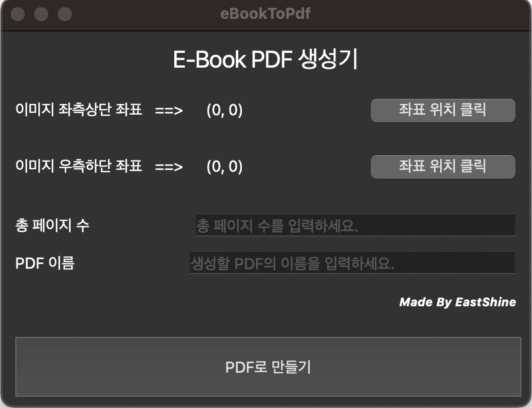

## 교보문고 eBook PDF 추출 프로그램 맞춤제작
### 개요
기술/IT/프로그래밍 관련 서적은 종이책은 너무 두껍고, 비싸다는 이유로 1~20% 저렴한 eBook을 구매하는 경우가 많다. 또, 근래에는 갤럭시탭 혹은 아이패드로 PDF를 읽어 패드로 필기하는 경우가 다반사이다. 이러한 이유로 교보문고에서 구매한 eBook을 PDF로 추출하는 프로그램을 맞춤제작하고자 한다. 

우선 먼저 만들어져 있는 프로그램이 있는지 확인 해보았는데, eastshine12님께서 eBookToPdf 프로그램을 만들어 놓으셨다. 이 프로그램은 윈도우 전용 프로그램이었다. `.py` 파일을 활용하여 VSC 로컬환경에서 사용하였으며 혼자 써먹기에 적당하게 수정하였다.

### 개발환경
- OS : macOS Sonama 14.xx
- IDE : Visual Studio Code 1.63.xx
- Language : Python 3.11.xx
- Library : pyautogui, mss, natsort, pynput, Pillow, PySide6

### 수정사항
- eastshine12님의 `.py` 파일을 그대로 실행할 경우 페이지가 전부 캡쳐가 되지 않는 문제가 발생하였다.
  - [x] `time.sleep()`을 계속해서 수정

### 현 코드의 문제점
- 현재 첫 페이지가 3번 캡쳐되고 마지막 페이지 -2만큼 캡쳐되는 문제가 발생
  - [ ] 첫 페이지 캡쳐가 3번 되는 문제 수정
  - [ ] 마지막 페이지 -2만큼 캡쳐되는 문제 수정
  - [ ] 현 코드에서 모든 페이지를 캡쳐하려면 `책 페이지 + 2` 만큼 캡쳐해야함
- PDF 제작 완료 후에도 마우스 커서가 움직이는 문제가 발생
  - [ ] PDF 제작 완료 후 마우스 커서가 움직이는 문제 수정

### 실행방법
```bash
$ python3 ebook2pdf.py
```


## Reference
<details>
<summary>&nbsp; eastshine12/eBookToPdf 참고 자료</summary>

### eBookToPdf
E-Book PDF 추출 프로그램<br />
제작 과정 : https://eastshine12.tistory.com/55
<br /><br /><br />


### 프로그램 화면

<br /><br /><br />

### 실행파일 위치
eBookToPdf/dist/ebook_to_pdf.exe
<br/><br/><br/>

### 사용법
1. '좌표 위치 클릭' 버튼 클릭 후 캡처할 영역의 좌측상단, 우측하단 좌표를 구한다.
2. 총 페이지 수와 생성할 PDF 이름을 작성한다.
3. 다음 페이지를 넘겨보며 화면이 완전히 랜더링되는 시간을 참고하여 캡처 속도를 조절한다.
4. PDF로 만들기 클릭!
5. 캡처 이미지가 많아지면, PDF 변환 시간이 길어질 수 있으므로 잠시 기다린다.
6. 'PDF 변환 완료!'라는 문구가 뜨면 PDF 생성이 완료된 것이다.
7. PDF 파일은 실행 파일과 같은 경로에 생성된다.
<br /><br /><br />

### 사용 시 유의사항
1. 해당 프로그램은 windows 전용 app이다.
2. 이미지 좌표 영역이 뷰어 영역을 벗어나면 안된다.
3. 반드시 키보드 오른쪽 방향키를 통해 다음 페이지 전환이 되어야 한다.
4. 페이지 수가 많을 경우 PDF 용량이 꽤 되므로 HDD 용량이 여유가 있어야 한다.
5. PDF 재생성 오류 시 프로그램을 재실행한다.

</details>